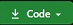

####Запуск проэкта:

1. Нажимаем на Code  и копируем ссылку
2. Запускаем редактор кода **Visual Studio Code** (или которым вы пользуетесь)
3. Открываем пустую папку, для этого вверху выбираем _File > Open Folder..._
4. Запускаем терминал,для этого вверху выбираем _Terminal > New Terminal_ либо сочетание клавишь **Ctrl+Shift+`**
5. Пишем команду:

```
git clone (вставляем нашу ссылку)
```

6. После того как загрузились все файлы, находим **index.html**, нажимаем на него правой кнопкой мыши и выбираем _Reveal in File Explorer_ либо сочетание клавишь **Shift+Alt+R**
7. Запускаем наш **index** файл,откроется браузер и проверяйте мою работу:)
